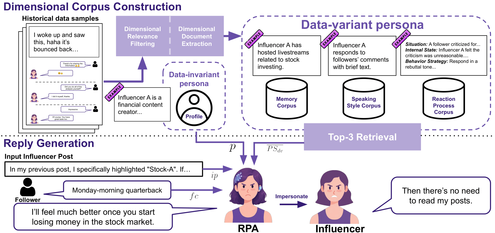

# From Memory to Behavior: A Behavior-Aware Role-Playing Framework for Social Media Influencers 

**From Memory to Behavior: A Behavior-Aware Role-Playing Framework for Social Media Influencers**

Ji-Lun Peng, Yi-Zhen Zhang, Chun-Nan Chou, Yun-Nung Chen, 2026

## Abstract
Large language models have shown strong potential as role-playing agents for real individuals, yet faithful impersonating remains challenging. Existing in-context learning-based methods fail to capture how individuals react under different situations. In addition, LLM-based evaluation is difficult for obscure individuals. To address these challenges, we propose \textbf{Situation--Internal state--Behavior Persona} method to incorporate situation-dependent behavioral strategies. We further design an evaluation protocol that provides LLM evaluators with references about the impersonated individual. We evaluate our approach on a newly constructed dataset for the task of generating replies on social media. Experimental results show that our proposed method outperforms state-of-the-art ICL-based baselines, while our evaluation protocol achieves moderate correlation with human judgment.
Besides, experiments on fictional-character benchmarks demonstrate that our proposed method is applicable beyond the social media setting. 
These findings suggest that incorporating behavioral information broadly improves the fidelity of role-playing for real individuals on social media or fictional characters.

<p align="center">
  <a href="#overview">Overview</a> •
  <a href="#installation">Installation</a> •
  <a href="#usage">Usage</a> •
  <a href="#experiments">Experiments</a> •
</p>

## Overview



We provide two implementations based on SIBPersona: (1) simulating social media influencers for comment-reply generation tasks, and (2) two fictional character role-playing benchmarks: CharacterEval and RoleAgentBench. Due to data privacy restrictions, we cannot release the social media influencer experimental data, but we provide complete experimental code along with mock data for researchers to reference and reproduce. All influencer-related examples in this repository — including the mock data under `influencer_simulation/data/` and the few-shot examples embedded in the prompts — are fully synthetic and do not contain any real user content. For CharacterEval and RoleAgentBench, we provide complete code for data preprocessing, persona construction, response generation, and evaluation, allowing researchers to directly reproduce our experimental results.

## Installation

### Prerequisites

- Python 3.12
- [uv](https://docs.astral.sh/uv/getting-started/installation/) (Python Dependency Manager)

### Setup

1. Install dependencies:

```bash
uv sync
```

2. Configure environment variables in `.env`:

```bash
# Add your API keys and configurations
AZURE_OPENAI_API_KEY=your_openai_api_key
...
# Add other required environment variables
```

## Usage

### Project Structure

```
influencer_simulation/
├──data/                                        # Dataset directory (mock data for influencer A)
├──preprocess/                                  # Data preprocessing scripts
│   ├── person_scoring.py                       # Script to generate persona scores for comment-reply pairs
│   └── sample_dataset.py                       # Sample 3 levels of dataset
│   └── dataset_pipeline.py                     # Dataset sampling pipeline
├── memory_recognizing.py                       # Dimensional document recognizing script
├── memory_extraction.py                        # Dimensional document extraction script
├── memory_module.py                            # Index building and document retrieval script
├── memory_pipeline.py                          # Main Dimensional document construction pipeline
├── agent.py                                    # Influencer simulation agent implementation
├── generate_outputs.py                         # Generate replies for test dataset
├── inference_pipeline.py                       # Experiment pipeline for comment-reply generation
├── prompt.py                                   # Prompt templates for persona processing and generation
open_source_dataset/
├── data/                                       # Dataset directory
│   ├── CharacterEval/
│   └── RoleAgentBench/
├── evaluation/                                 # Evaluation scripts
│   ├── evaluation_pipeline.py
│   └── LLM_evaluation.py
├── IMPersona/                                  # Baseline implementation
├── preprocess/                                 # Data preprocessing scripts
├── memory_recognizing.py                       # Dimensional document recognizing script
├── memory_extraction.py                        # Dimensional document extraction script
├── memory_module.py                            # Index building and document retrieval script
├── memory_pipeline.py                          # Main Dimensional document construction pipeline
├── agent.py                                    # Fictional character simulation agent implementation
├── generate_outputs.py                         # Generate replies for test dataset
├── generate_outputs_impersona.py               # Generate replies for test dataset (IMPersona)
└── prompt.py                                   # Prompt templates for persona processing and generation
```

### Quick Start

#### Influencer Simulation

1. **Preprocess Data**: Identify the persona scores of comments and sample test dataset using `preprocess/dataset_pipeline.py`
3. **Build Dimensional Corpus**: Construct dimensional corpus using `memory_pipeline.py`
4. **Generate Responses**: Use `inference_pipeline.py` for response generation

#### Open Source Datasets (CharacterEval & RoleAgentBench)

1. **Preprocess Data**: Prepare your dataset using the preprocessing scripts in `preprocess/`
2. **Build Dimensional Corpus**: Construct dimensional corpus using `memory_pipeline.py`
3. **Generate Responses**: Use `generate_outputs.py` for response generation
4. **Evaluate**: Assess performance using evaluation scripts in `evaluation/`

## Experiments

### Constructing Influencer's Dimensional Corpus and Simulating Comment-Reply Generation

#### Step 1: Data Preparation

Identify the persona scores of comment-reply pairs in `influencer_simulation/data/`, then perform stratified sampling to obtain datasets at three different levels.

```bash
cd influencer_simulation
cd preprocess
uv run python dataset_pipeline.py --persona_score_model gpt-4o-mini --sample_n 50
cd ..
```

#### Step 2: Dimensional Corpus Construction

Build the influencer's dimensional corpus.

```bash
uv run python memory_pipeline.py \
    --recognizing_model gpt-4o-mini \
    --extraction_model gpt-4o-mini
```


#### Step 3: Response Generation

Use the SIBPersona to generate responses for the three-level test sets.

```bash
uv run python inference_pipeline.py \
    --persona_score_model gpt-4o-mini \
    --recognizing_model gpt-4o-mini \
    --extraction_model gpt-4o-mini \
    --generate_model gpt-4.1
```


### Reproducing CharacterEval Results

#### Step 1: Data Preparation

Clone the [CharacterEval dataset](https://github.com/morecry/CharacterEval) into `open_source_dataset/data/`, and then preprocess:

```bash
cd open_source_dataset/data/
git clone https://github.com/morecry/CharacterEval.git
cd ..
cd preprocess
uv run python preprocess_characterEval.py
cd ..
```

#### Step 2: Dimensional Corpus Construction

Build the memory bank using our pipeline:

```bash
uv run python memory_pipeline.py \
    --dataset CharacterEval \
    --language zh \
    --recognizing_model gpt-4o-mini \
    --extraction_model gpt-4o-mini
```

**For baseline (IMPersona) experiments:**

```bash
cd IMPersona
uv run python memory_pipeline.py \
    --dataset CharacterEval \
    --language zh \
    --recognizing_model gpt-4o-mini \
    --extraction_model gpt-4o-mini
cd ..
```

#### Step 3: Response Generation

```bash
bash CharacterEval.sh
```

#### Step 4: Evaluation

Use the reward model evaluation method provided in the CharacterEval benchmark.

---

### Reproducing RoleAgentBench Results

#### Step 1: Data Preparation

Clone the [RoleAgentBench dataset](https://huggingface.co/datasets/RoleAgent/RoleAgentBench) into `open_source_dataset/data/RoleAgentBench`, then preprocess:

```bash
cd open_source_dataset/data/
git clone https://huggingface.co/datasets/RoleAgent/RoleAgentBench
cd ..
cd preprocess
uv run python preprocess_roleagentbench.py
cd ..
```

#### Step 2: Dimensional Corpus Construction

```bash
uv run python memory_pipeline.py \
    --dataset RoleAgentBench \
    --language zh \
    --recognizing_model gpt-4o-mini \
    --extraction_model gpt-4o-mini

uv run python memory_pipeline.py \
    --dataset RoleAgentBench \
    --language eng \
    --recognizing_model gpt-4o-mini \
    --extraction_model gpt-4o-mini
```

**For baseline (IMPersona) experiments:**

```bash
cd IMPersona
uv run python memory_pipeline.py \
    --dataset RoleAgentBench \
    --language zh \
    --recognizing_model gpt-4o-mini \
    --extraction_model gpt-4o-mini
uv run python memory_pipeline.py \
    --dataset RoleAgentBench \
    --language eng \
    --recognizing_model gpt-4o-mini \
    --extraction_model gpt-4o-mini
cd ..
```

#### Step 3: Response Generation

```bash
bash RoleAgentBench.sh
```

#### Step 4: LLM Penalty-Based Evaluation (Because `gemini-2.0-flash` is out of service, we provide scripts using `gemini-2.5-flash`)

```bash
cd evaluation
uv run python evaluation_pipeline.py \
    --extraction_model gpt-4o-mini \
    --evaluation_model gemini-2.5-flash
cd ..
```

#### Step 5: Pairwise Evaluation

```bash
bash pair_wise.sh
```
---
